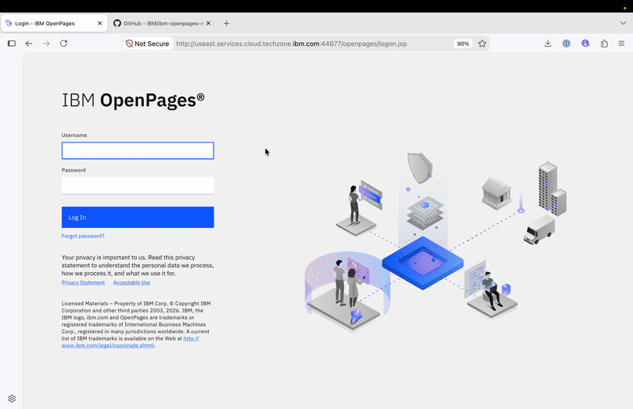
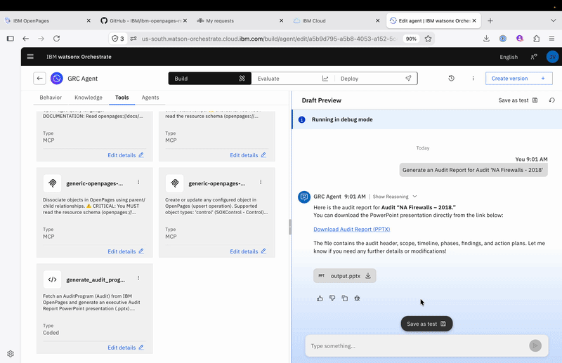
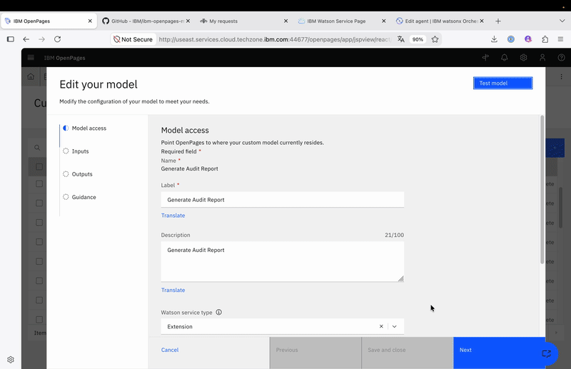
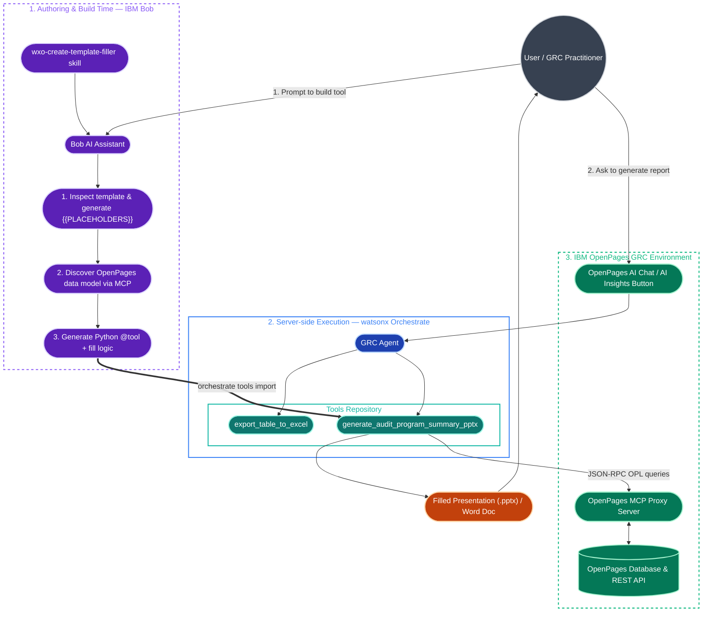

# IBM OpenPages — AI Document Generation with IBM Bob and Orchestrate

This repository contains all assets needed to demonstrate AI Document Generation capabilities infused into an
IBM OpenPages GRC environment using [**IBM watsonx Orchestrate**](https://www.ibm.com/products/watsonx-orchestrate) and [**IBM Bob**](https://bob.ibm.com).

---

## The need: AI-powered document generation

GRC practitioners spend significant time manually producing recurring documents — audit reports, workpaper summaries, risk assessments — by copy-pasting data out of OpenPages into Word or PowerPoint templates. AI can automate this entirely.

### Quick-start approach — Bob + skills + OpenPages MCP

The fastest way to experience this is to use two skills available on [Propel](https://propel.ibm.com/) — the **`docx`** and **`pptx`** skills — combined with the [IBM OpenPages MCP Server](https://github.com/IBM/ibm-openpages-mcp-server). With Bob connected to OpenPages via MCP, you can ask it to pull live GRC data and fill any Office template in one prompt — no code required.



---

## The caveats

While this approach is powerful for experimentation, it has real limitations in enterprise contexts:

- **Requires local tooling** — Bob (or a similar AI coding tool such as Codex or Claude) must be installed and the OpenPages MCP server must be configured on each user's machine.
- **Not deterministic** — each generation is a fresh LLM call; the output varies, whereas enterprises typically require a fixed, approved document template.
- **Slow and expensive** — a full document generation run against a frontier model takes around **5 minutes** and consumes a non-trivial number of tokens.
- **Hard to scale** — there is no way to surface this capability to end-users directly inside OpenPages without each of them installing and configuring the same toolchain.

---

## The solution: teach watsonx Orchestrate to generate the document

The right answer for production use is to encapsulate the entire generation logic into a **single watsonx Orchestrate tool**, wired to a pre-approved document template. This unlocks four benefits at once:

- **Always the same template** — the output is deterministic and brand-compliant.
- **Fast, no install required** — the tool runs server-side; users need nothing on their machine.
- **Surfaced directly in OpenPages** — the agent can be embedded in the OpenPages **AI Chat** or triggered via an **AI Insights** button right inside the Task View of any object.
- **Massifiable** — one deployment serves all users on the instance simultaneously.

---

## Building the solution with Bob

Use Bob with the **`orchestrate_adk`** MCP server and the **`wxo-create-template-filler`** skill to have Bob build the Orchestrate tool end-to-end: it inspects the template, queries OpenPages to discover the data model, writes an implementation plan, and produces a self-contained Python `@tool` ready to import into watsonx Orchestrate and attach to your GRC Agent.


---

## Deploying the agent to OpenPages AI Chat

Once the tool is imported into watsonx Orchestrate and added to your GRC Agent, surfacing it in OpenPages AI Chat is a simple two-step configuration:

1. **Deploy the agent live** in watsonx Orchestrate.
2. **Copy the agent JSON**, then **paste it into the OpenPages AI Chat configuration**.

That's all. Refresh OpenPages and you can immediately test your GRC Agent in the Chat.



---

## Adding a document generation button in the Task View (AI Insights)

For an even more seamless user experience, you can add a one-click **Generate Document** button directly on the Task View of any OpenPages object. This is a two-step procedure.

**Step 1 — Connect OpenPages to your Orchestrate instance**

Create an **OpenPages Extension** using the OpenAPI spec provided in this repository, pointing to your watsonx Orchestrate instance URL. Then create an **OpenPages Custom Machine Learning Model** that prompts your Orchestrate Agent to generate the document when the button is clicked.


**Step 2 — Add the AI Insights button to the Task View**

Update the view configuration to include the AI Insights button on the Task View of the relevant object type. Once done, any OpenPages user with access to that view can generate the document in a single click — no chat, no prompting, no tooling required.



---

## Details

### Architecture and Component Interactions

The following schema illustrates how **IBM Bob**, **watsonx Orchestrate**, the **GRC Agent**, the **Custom Python Tools**, and **IBM OpenPages** interact during both tool creation and live runtime document generation:



---

### Prompt Used to Generate the Tool

The tool was created by providing Bob with the `wxo-create-template-filler` skill and running the following prompt:

```text
I want to build a new document generator tool for watsonx Orchestrate.

Sample document:       input/AR-2018-Audit-Report.pptx
corresponding to the sample object below:
Top-level object type: AuditProgram
Sample object name:    "Accounts Receivable - 2018"
MCP proxy URL:         https://generic-openpages-mcp-server.2c20hyggoq5p.us-south.codeengine.appdomain.cloud/mcp

Please follow the wxo-create-template-filler procedure end-to-end:
1. Inspect the sample document and propose a simplified template with {{PLACEHOLDERS}}
2. Discover the OpenPages data model using the sample object
3. Write IMPLEMENTATION_PLAN.md in tools/<tool-name>/
4. Implement the single Python @tool:
   - generate_<name>_docx (or _pptx) — calls MCP proxy, fetches data, fills template, returns bytes
5. Add import-all.sh and update agents/GRC_Agent.yaml
```

---

## Repository structure

```
.
├── agents/
│   └── GRC_Agent.yaml                              ← GRC agent definition (customise me)
│
├── ai_insights/                                    ← AI Insight prompt templates
│   ├── wxo-openapi-with-default-v1.yaml            ← OpenAPI spec for the OpenPages extension
│   ├── 5w_analysis/
│   │   └── prompt.md                               ← 5W analysis on control description
│   └── action_suggestion/
│       └── prompt.md                               ← Remediation action items for issues
│
├── assets/                                         ← Demo GIFs
│
├── input/
│   └── AR-2018-Audit-Report.pptx                   ← Sample source document (reference)
│
├── scripts/
│   └── openpages_cookie_login.sh                   ← Helper: obtain an OpenPages session cookie
│
├── tools/
│   ├── generate_audit_program_summary_pptx/        ← Audit summary PPTX (AuditProgram)
│   │   ├── generate_audit_program_summary_pptx.py  ← Single-tool entry point
│   │   ├── audit_program_summary_template_v1.pptx  ← PPTX template with {{PLACEHOLDERS}}
│   │   ├── IMPLEMENTATION_PLAN.md
│   │   ├── import-all.sh
│   │   └── requirements.txt
│   ├── generate_audit_report_docx/                 ← Audit Report DOCX (AuditProgram)
│   │   ├── generate_audit_report_docx.py           ← Single-tool entry point
│   │   ├── generate_audit_report_flow.py           ← Legacy 2-node flow wrapper
│   │   ├── assemble_audit_payload.py               ← Legacy node 1 (fetch & clean)
│   │   ├── audit_report_template_v1.docx           ← DOCX template with {{PLACEHOLDERS}}
│   │   ├── IMPLEMENTATION_PLAN.md
│   │   ├── import-all.sh
│   │   └── requirements.txt
│   └── export_table_to_excel/                      ← Export any conversation table to XLSX
│       ├── export_table_to_excel.py
│       └── requirements.txt
│
├── toolkits/
│   └── openpages-mcp/
│       └── openpages-mcp.yaml                      ← MCP toolkit definition (update URL)
│
├── workspace/                                      ← Scratch workspace (design artefacts)
│
├── .env.sample                                     ← Copy to .env and fill credentials
├── workspace_config.yaml                           ← WXO ADK workspace paths
└── .bob/                                           ← Bob IDE config (skills, MCP servers)
    ├── mcp.json                                    ← MCP server registrations
    └── skills/
        ├── wxo-create-template-filler/             ← Bob skill: build a new doc generator
        └── wxo-builder/                            ← Bob skill: general WXO agent builder
```
